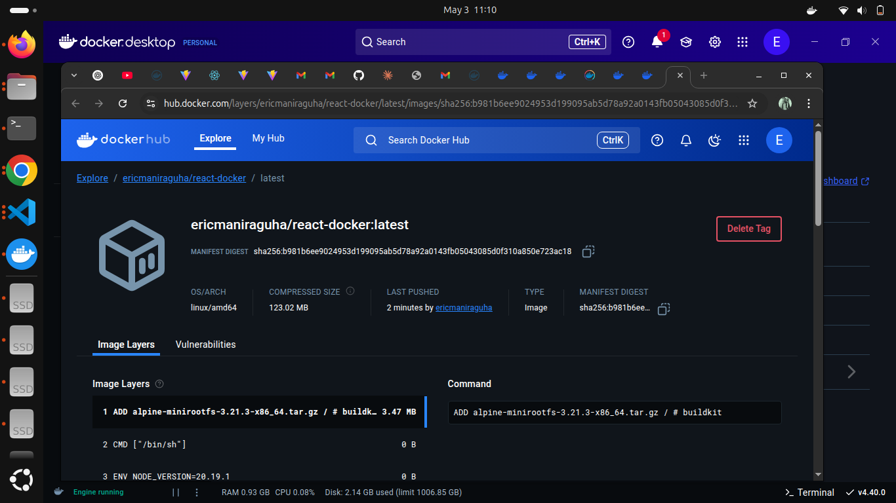

# React Docker Development Environment

This repository contains a Dockerized React application bootstrapped with Vite. It enables you to run the development environment inside a Docker container, providing a consistent development experience across different machines.

## Project Structure

```
react-docker/
├── Dockerfile
├── package.json
├── vite.config.ts
├── tsconfig.json
├── public/
└── src/
    ├── App.tsx
    ├── main.tsx
    └── ...
```

## Prerequisites

- [Docker](https://www.docker.com/products/docker-desktop/) must be installed on your machine

## Quick Start

### Build the Docker Image

```bash
docker build -t react-docker .
```

### Run the Development Server

```bash
docker run -p 5173:5173 react-docker
```

The application will be available at [http://localhost:5173](http://localhost:5173)

## Docker Configuration

### Dockerfile Overview

```dockerfile
# Use official Node Alpine image for smaller size
FROM node:20-alpine

# Create app user and group for security
RUN addgroup app && adduser -S -G app app

# Set working directory
WORKDIR /app

# Copy dependency files
COPY package*.json ./

# Fix permissions
RUN chown -R app:app /app

# Switch to non-root user
USER app

# Install dependencies
RUN npm install

# Copy all source code
COPY . .

# Expose port for Vite dev server
EXPOSE 5173

# Run development server with host flag to expose network
CMD ["npm", "run", "dev", "--", "--host", "0.0.0.0"]
```

### Security Features

- The application runs as a non-root user (`app`) inside the container for better security
- Uses the Alpine-based Node.js image to reduce attack surface and image size

## Example Output

When running the container, you should see output similar to:

```bash
> react-docker@0.0.0 dev
> vite

  VITE v6.3.4  ready in 240 ms

  ➜  Local:   http://localhost:5173/
  ➜  Network: http://172.17.0.2:5173/
```

## Docker Hub Deployment

### Login to Docker Hub

```bash
docker login --username ericmaniraguha
```

### Tag your Image

```bash
docker tag react-docker:latest ericmaniraguha/react-docker
```

### Push to Docker Hub

```bash
docker push ericmaniraguha/react-docker
```

## Screenshots




## Future Improvements

- **Live Development**: Add volume mounts for live editing:
  ```bash
  docker run -p 5173:5173 -v "$(pwd):/app" -v /app/node_modules react-docker
  ```

- **Production Setup**: Create multi-stage Dockerfile for production builds using NGINX:
  ```dockerfile
  # Build stage
  FROM node:20-alpine AS build
  WORKDIR /app
  COPY package*.json ./
  RUN npm install
  COPY . .
  RUN npm run build

  # Production stage
  FROM nginx:alpine
  COPY --from=build /app/dist /usr/share/nginx/html
  EXPOSE 80
  CMD ["nginx", "-g", "daemon off;"]
  ```

- **Optimization**: Add a `.dockerignore` file to reduce image size:
  ```
  node_modules
  dist
  .git
  .github
  .vscode
  ```

## Running in Production

To build and run the production version (requires creating the multi-stage Dockerfile mentioned above):

```bash
# Build production image
docker build -t react-docker-prod -f Dockerfile.prod .

# Run production container
docker run -p 80:80 react-docker-prod
```

## License

MIT